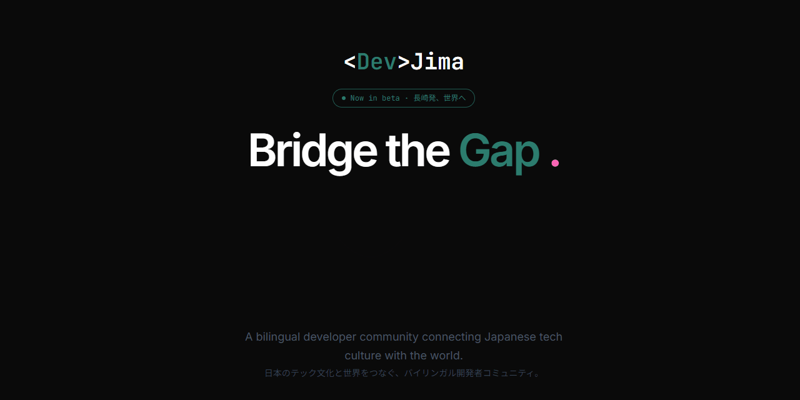
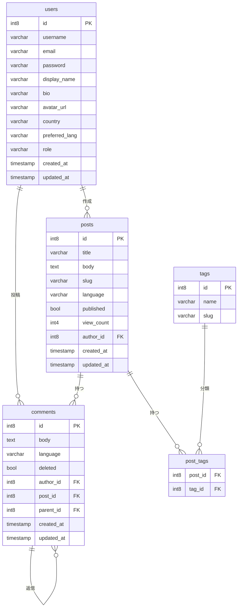
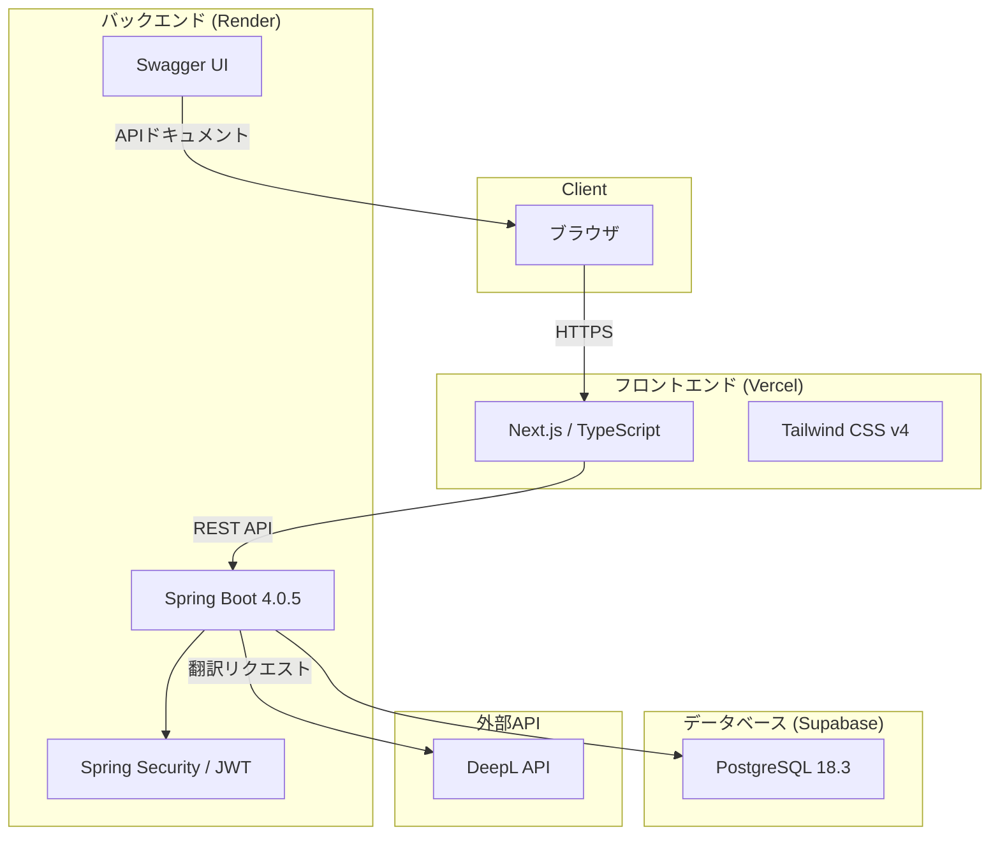

<details open>
<summary>目次</summary>
    
## 目次

- [プロジェクト概要](#1-プロジェクト概要)
- [デモ](#2-デモ)
- [技術スタック](#3-技術スタック)
- [機能一覧](#4-機能一覧)
- [工夫した点](#5-工夫した点)
- [システム設計](#6-システム設計)
- [セットアップ手順](#7-セットアップ手順)
- [テスト](#8-テスト)
- [APIドキュメント](#9-apiドキュメント)
- [今後の予定](#10-今後の予定)

</details>
<details open>
<summary>プロジェクト概要</summary>

## 1. プロジェクト概要

**DevJima**は、日本のIT市場に特化したバイリンガル開発者コミュニティプラットフォームです。
既存サービスとは異なり、スカウトや求人ではなく**開発者同士のピアツーピアな知識共有**を中心に設計されています。

日本のIT業界には、言語・文化・情報格差という壁が存在します。グローバルな視点を求める日本人開発者と、日本のIT文化を理解しようとする外国人開発者、そしてIT業界へのキャリアチェンジを目指す人々に向けて、コードスニペット・技術ディスカッション・リアルな開発体験を共有できる場を提供します。

### DevJimaでできること

- 日本語・英語どちらでも投稿・コメントが可能
- Markdown形式でコードスニペットを含む技術記事を投稿
- ワンクリックでDeepL APIによる投稿の翻訳
- タグ・キーワード・言語でコンテンツをフィルタリング
- 世界中の日本在住開発者とスレッド形式で交流

### 対象ユーザー

**（例）ユーザーA — 日本人開発者**<br>
海外の最新技術や開発文化に興味はあるが、言語の壁でグローバルなコミュニティとつながりにくい開発者。

**（例）ユーザーB — 日本を目指す外国人エンジニア**<br>
日本への移住・就職を検討している、またはすでに日本で働いている外国人開発者。日本のIT業界の実情をリアルな声から学びたい。

**（例）ユーザーC — IT業界へのキャリアチェンジャー**<br>
異業種からIT業界への転職を考えている人。コミュニティの力を借りながら新しいスキルを学びたい初学者。

### 作成背景

Spring BootとNext.jsの学習成果を実践的なプロジェクトとして形にするために開発しました。
日本でIT業界に入る外国人開発者として、自分自身がこのような場の必要性を感じたことが最大の動機です。

</details>
<details open>
<summary>デモ</summary>

## 2. デモ

### フローA：新規ユーザーの体験

1. ランディングページ
2. 新規登録を行う
3. 投稿詳細を見る
4. DeepL APIによる翻訳機能を体験する


### フローB：既存ユーザーのアクティビティ

1. ログイン
2. 投稿作成を行う
3. コメント、コメント返信・削除をする
4. 投稿を編集する
5. 投稿を削除する

### フローC：プロフィール編集・検索フィルター

1. プロフィールを確認する
2. 「最近の投稿」を体験する
3. プロフィールを編集する
4. 検索フィルター（タグ、言語、キーワード）を体験する
5. ログアウト後、認証機能によるプロフィール編集の不可能

</details>
<details open>
<summary>技術スタック</summary>

## 3. 技術スタック

### バックエンド


### フロントエンド


### ツール・その他


### 翻訳


### コード品質


### デプロイ


</details>
<details open>
<summary>機能一覧</summary>

## 4. 機能一覧

| 機能 | 詳細 |
| --- | --- |
| ユーザー認証 | JWT認証によるユーザー登録・ログイン・ログアウト |
| 投稿作成・編集・削除 | Markdownエディタで投稿を作成し、HTMLとしてレンダリング |
| シンタックスハイライト | コードブロックを自動でハイライト表示（highlight.js） |
| 翻訳機能 | DeepL APIを使用し、投稿を日本語・英語に翻訳 |
| タグ管理 | 投稿にタグを付与し、タグでフィルタリング |
| 言語フィルター | 日本語・英語投稿をフィルタリング |
| キーワード検索 | 投稿タイトル・本文をデバウンス処理付きで検索 |
| コメント・返信 | 投稿へのコメントおよびスレッド形式の返信 |
| ソフトデリート | コメントの論理削除による履歴保持 |
| プロフィール管理 | 表示名・自己紹介・言語設定・国の編集 |
| 権限管理 | 投稿・コメントの編集・削除を投稿者本人のみに制限 |
| APIドキュメント | Swagger UIによるREST APIドキュメントの自動生成 |

</details>
<details open>
<summary>工夫した点</summary>

## 5. 工夫した点

### ・ 出島コンセプトの一貫性
単なる技術デモに留まらず、江戸時代の出島という歴史的背景をプラットフォームのコンセプトに落とし込みました。バイリンガル対応・翻訳機能・言語フィルターなど、すべての機能設計が「日本と世界をつなぐ」というテーマに基づいています。

### ・ シークレット管理
データベースのパスワードやJWTシークレット・DeepL APIキーなどの機密情報を`application-local.properties`にまとめ、Spring Profilesで環境を分離しました。誤ってGitにコミットしないよう`.gitignore`で管理し、セキュリティを意識した開発を行いました。

### ・ DTOパターンの徹底
エンティティを直接APIレスポンスとして返さず、`UserProfileDTO`・`PostResponseDTO`・`CommentResponseDTO`などのDTOクラスを設計しました。内部モデルの変更がAPIに影響しない設計を意識しています。

### ・ コメントの論理削除
コメントを物理削除せず`deleted`フラグによる論理削除を実装しました。返信スレッドの整合性を保ちながら、削除済みコメントを「このコメントは削除されました」として表示できる設計にしています。

### ・ 翻訳機能のコードブロック除外
DeepL APIで投稿を翻訳する際、コードブロック内のコードが翻訳されないよう処理を実装しました。技術記事においてコードの意味が変わってしまう問題を防いでいます。

### ・ デバウンス処理による検索最適化
検索バーの入力ごとにAPIリクエストが発生する問題を、300msのデバウンス処理で解決しました。UXを損なわずにサーバー負荷を軽減しています。

### ・ Testcontainersによる統合テスト
モックではなく実際のPostgreSQLコンテナを使用したTestcontainersで統合テストを実装しました。本番環境に近い条件でのテストにより、DBレベルのバグを早期に発見できる設計にしています。合計124件のテストを実装しています。

</details>
<details open>
<summary>システム設計</summary>

## 6. システム設計

### ER図



### アーキテクチャ図



### 画面遷移図

| ページ | URL | 認証必須 |
|--------|-----|----------|
| ランディング | `/landing` | 不要 |
| 新規登録 | `/register` | 不要 |
| ログイン | `/login` | 不要 |
| フィード | `/` | 不要 |
| 投稿詳細 | `/posts/[id]` | 不要 |
| 投稿作成 | `/posts/new` | 必要 |
| 投稿編集 | `/posts/[id]/edit` | 必要（投稿者のみ） |
| プロフィール | `/profile/[id]` | 不要 |
| プロフィール編集 | `/profile/[id]/edit` | 必要（本人のみ） |

</details>
<details closed>
<summary>セットアップ手順</summary>
    
## 7. セットアップ手順

### 前提条件
- Java 21
- Node.js 18以上
- PostgreSQL 18
- Gradle

### 1. リポジトリのクローン

```bash
git clone https://github.com/VilliDoug/devjima.git
cd devjima
```

### 2. バックエンドの設定

`backend/src/main/resources/application-local.properties` を作成し、以下を記述：

```properties
spring.datasource.url=jdbc:postgresql://localhost:5432/devjima
spring.datasource.username=your_username
spring.datasource.password=your_password
jwt.secret=your_jwt_secret_256bits
deepl.api.key=your_deepl_api_key
```

バックエンドの起動：

```bash
cd backend
./gradlew bootRun
```

### 3. フロントエンドの起動

フロントエンドはデフォルトで `http://localhost:8080/api` に接続します。
別のURLを使用する場合は環境変数 `NEXT_PUBLIC_API_URL` を設定してください。

```bash
cd frontend
npm install
npm run dev
```

### 4. アクセス

> ⚠️ **注意**⚠️ <br>
> - バックエンドはRenderの無料プランにデプロイしているため、<br>
> - 初回アクセス時にサーバーの起動に数十秒かかる場合があります。<br>
> - ご了承いただければ幸いです。

| サービス | URL |
|----------|-----|
| フロントエンド | http://localhost:3000 |
| バックエンド API | http://localhost:8080/api |
| Swagger UI | https://villidoug.github.io/devjima |

> 💡 **Swagger UIの認証方法:** 
> 1. まず `/api/auth/register` または `/api/auth/login` でトークンを取得
> 2. 右上の「Authorize」ボタンをクリック
> 3. `Bearer your_token_here` の形式で入力

> 🔑 **デモ用アカウント:** <br>
> { <br>
>  "email": "sarah@devjima.com", <br>
>  "password": "password123" <br>
> } <br>

</details>

## 8. テスト

### バックエンドテスト

JUnit5・Mockito・Testcontainersを使用した自動テストを実装しています。

| テスト種別 | ツール | 内容 |
|------------|--------|------|
| 単体テスト | JUnit5 + Mockito | Controller層・Service層のビジネスロジック検証 |
| 統合テスト | Testcontainers + Docker | 実際のPostgreSQLコンテナを使用したDB操作の検証 |

- **合計テスト数: 124件**

テストの実行：

```bash
cd backend
./gradlew test
```

テストレポート：[GitHub Pages - /tests/index.html](https://villidoug.github.io/devjima/tests/index.html)

### フロントエンドテスト

現時点ではフロントエンドの自動テストは未実装です。今後の予定に記載しています。

<details closed>
<summary>APIドキュメント</summary>

## 9. APIドキュメント

REST APIはSwagger UIで公開しています。
✔ [Swagger UI](https://villidoug.github.io/devjima/api/)

### エンドポイント一覧

#### 認証 `/api/auth`
| メソッド | URL | 認証 | 説明 |
|----------|-----|------|------|
| POST | `/api/auth/register` | 不要 | 新しいユーザーアカウントを作成する |
| POST | `/api/auth/login` | 不要 | メールアドレスとパスワードで認証し、JWTトークンを返す |

#### 投稿 `/api/posts`
| メソッド | URL | 認証 | 説明 |
|----------|-----|------|------|
| GET | `/api/posts` | 不要 | システム内の全投稿を返す |
| GET | `/api/posts/recent` | 不要 | 作成日時の降順で全投稿を返す |
| GET | `/api/posts/count` | 不要 | 投稿の総数を返す |
| GET | `/api/posts/{id}` | 不要 | 指定されたIDの投稿を返す |
| GET | `/api/posts/search` | 不要 | タイトル・言語・両方で投稿を検索する |
| GET | `/api/posts/tag/{slug}` | 不要 | 指定されたタグスラッグに関連する全投稿を返す |
| GET | `/api/posts/user/{userId}` | 不要 | 指定されたユーザーの全投稿を返す |
| POST | `/api/posts/new` | 必要 | 認証済みユーザーが新しい投稿を作成する |
| PUT | `/api/posts/{id}` | 必要 | 投稿を更新する。著者のみ更新可能 |
| DELETE | `/api/posts/{id}` | 必要 | 投稿を削除する。著者のみ削除可能 |

#### コメント `/api/comments`
| メソッド | URL | 認証 | 説明 |
|----------|-----|------|------|
| GET | `/api/comments/post/{postId}` | 不要 | 指定された投稿のトップレベルコメント一覧を返す |
| POST | `/api/comments/post/{postId}` | 必要 | 指定された投稿にコメントを追加する |
| POST | `/api/comments/reply/{commentId}` | 必要 | 指定されたコメントに返信を追加する |
| DELETE | `/api/comments/{id}` | 必要 | コメントを論理削除する。著者のみ削除可能 |

#### ユーザー `/api/users`
| メソッド | URL | 認証 | 説明 |
|----------|-----|------|------|
| GET | `/api/users/{id}` | 不要 | 指定されたIDのユーザープロフィールを返す |
| PUT | `/api/users/{id}` | 必要 | ユーザープロフィールを更新する。本人のみ更新可能 |
| GET | `/api/users/count` | 不要 | 登録ユーザーの総数を返す |
| GET | `/api/users/countries/count` | 不要 | 登録ユーザーの出身国の総数を返す |

#### タグ `/api/tags`
| メソッド | URL | 認証 | 説明 |
|----------|-----|------|------|
| GET | `/api/tags` | 不要 | システム内の全タグ一覧を返す |
| POST | `/api/tags/{tagId}/posts/{postId}` | 必要 | 指定された投稿に指定されたタグを追加 |
| DELETE | `/api/tags/{tagId}/posts/{postId}` | 必要 | 指定された投稿から指定されたタグを削除する |

#### 翻訳 `/api/translate`
| メソッド | URL | 認証 | 説明 |
|----------|-----|------|------|
| POST | `/api/translate` | 不要 | DeepL APIを使用してHTMLコンテンツを翻訳する。コードブロックは翻訳対象外 |

</details>

## 10. 今後の予定

| 機能 | 内容 |
|------|------|
| アバターアップロード | プロフィール画像のアップロード機能（Supabase Storage） |
| パスワード変更 | 設定画面からのパスワード変更機能 |
| ユーザー名重複チェック | 登録時のリアルタイムユーザー名バリデーション |
| ADMINロール | 管理者による投稿・コメントの管理機能 |
| フロントエンドテスト | Jest・React Testing Libraryを使用した自動テストの実装 |
| 既読・いいね機能 | 投稿へのリアクション機能 |
| 通知機能 | コメント・返信の通知 |
| ライトモード切替 | システム設定に依存しない手動切替 |
| モバイル対応 | レスポンシブデザインの改善 |
| 翻訳キャッシュ | 翻訳済みコンテンツのキャッシュ保存による API コスト削減 |
| i18n対応 | UI の日本語・英語切替（ユーザーの言語設定に基づく自動切替） |
